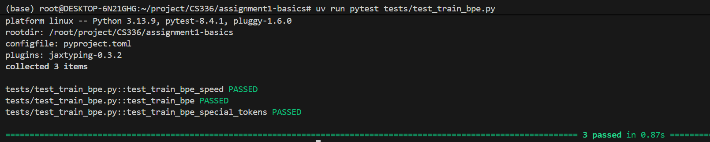
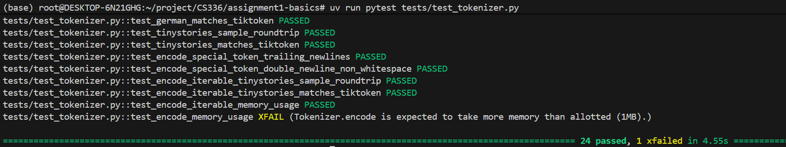
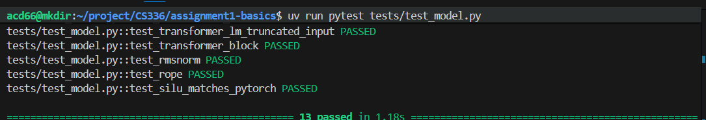
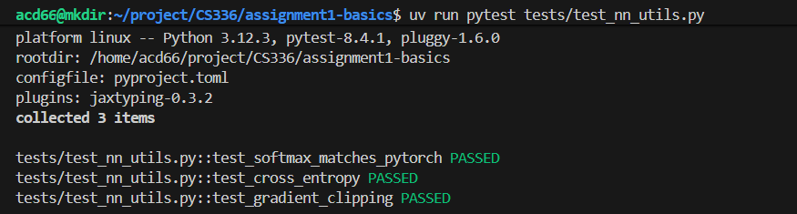
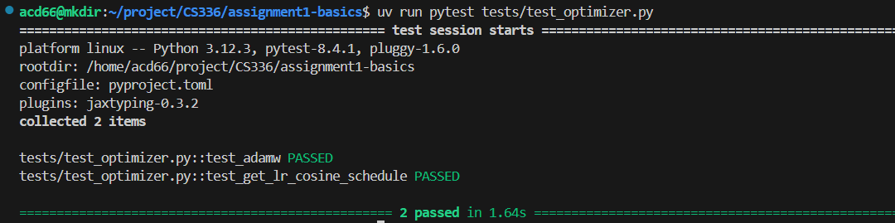
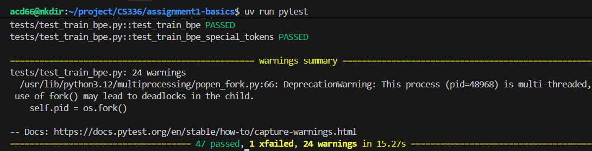
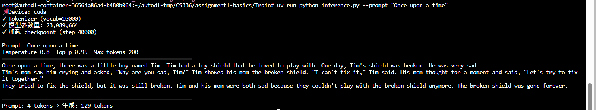

# 📚 CS336: Large Language Model Systems


这是我的 Stanford CS336 课程作业仓库，记录了从零开始构建大模型系统的全过程。

- **飞书云文档**: [点击查看详细笔记](https://nankai.feishu.cn/wiki/RZOXw0qeCi25PtkNT7RctOCEnJh)
- **个人博客**: [Lorn3's Blog](https://lorn3.bearblog.dev/)

---

## 📂 目录结构

- `assignment1-basics/`：Transformer 基础实现
  - Tokenizer, Model Architecture, Optimizer, Training Loop, Inference
- `assignment2-systems/`：系统优化与并行训练
  - Profiling, Triton Kernels, DDP, ZeRO

## 🚀 快速开始

建议使用 Python 3.11+ 环境。仓库使用 **单一共享环境**（在仓库根目录），避免 `a1`/`a2` 分别创建环境。

```bash
  curl -LsSf https://astral.sh/uv/install.sh | sh 
  source $HOME/.local/bin/env
  uv sync
```

## 📊 进度说明

### 1. Basics (Assignment 1)
> ✅ 已完成 (2024.02.10)

- [x] **1.1 BPE Tokenizer** (1.31)
  - 
  - 
- [x] **1.2 Transformer Language Model** (2.4)
  - 
- [x] **1.3 Cross-Entropy Loss & AdamW Optimizer** (2.9)
  - 
  - 
- [x] **1.4 Training Loop & Checkpointing** (2.10)
  - 
- [x] **1.5 Inference** (2.10)
  - *Note: 仅在 TinyStories 上进行最终训练与测试，未进行额外消融实验。*
  - 

### 2. Systems (Assignment 2)
> 🚧 进行中...

- [x] **Benchmarking and profiling harness**(3.12)
- [ ] **Flash Attention 2 Triton Kernel**
- [ ] **Distributed data parallel training**
- [ ] **Optimizer state sharding**

### 3. Scaling
- [ ] (待定)

### 4. Data
- [ ] (待定)

### 5. Alignment and Reasoning RL
- [ ] (待定)

---

## 📝 额外产出

会在博客中更新一些额外的学习内容与思考。

- [x] [关于 LLM 中位置编码的思考](https://lorn3.bearblog.dev/transformer/)

- [x] Triton Puzzles Lite Via Block Pointer [题库](https://github.com/SiriusNEO/Triton-Puzzles-Lite)  [解答Blog](https://lorn3.bearblog.dev/triton/)

## ⚠️ 备注

如需复现实验结果或提交作业，请以课程官方要求为准。
