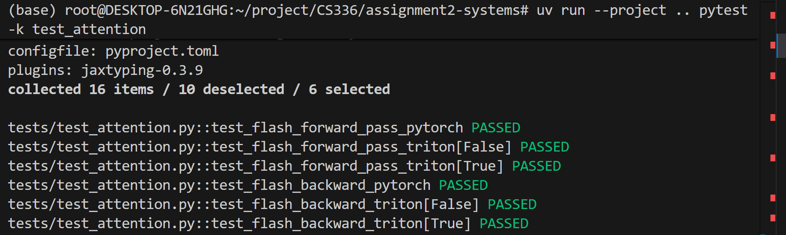
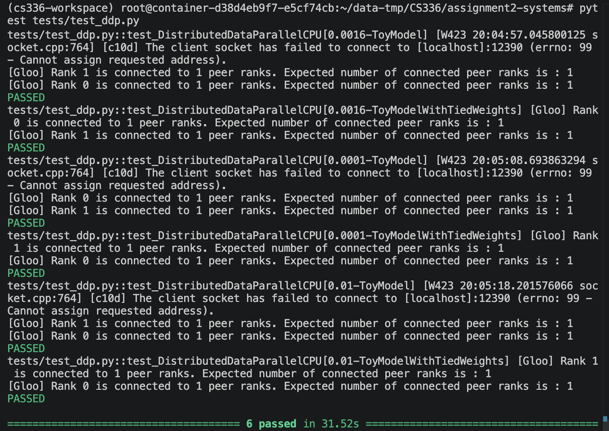
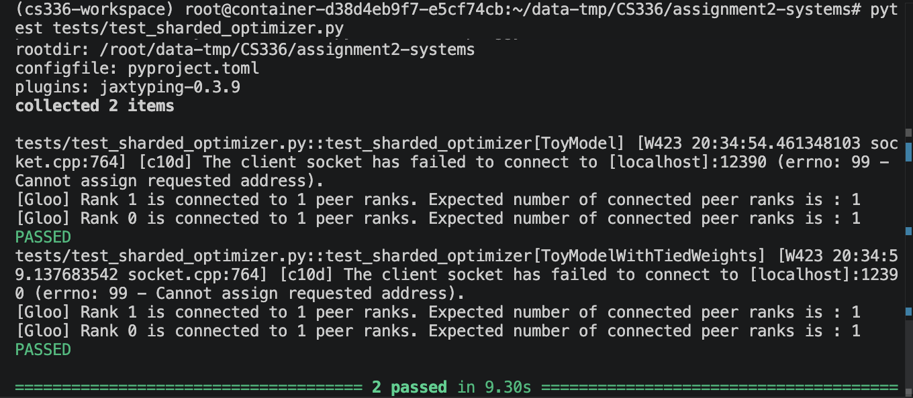

# 📚 CS336: Large Language Model Systems


这是我的 Stanford CS336 课程作业仓库，记录了从零开始实现大语言模型系统的过程，包括基础模型组件、训练流水线、Triton 内核、分布式训练与优化器状态分片等内容。

- **飞书云文档**: [点击查看详细笔记](https://nankai.feishu.cn/wiki/RZOXw0qeCi25PtkNT7RctOCEnJh)
- **个人博客**: [Lorn3's Blog](https://lorn3.bearblog.dev/)

---

## 📂 目录结构

- `assignment1-basics/`：Transformer 基础实现
  - Tokenizer, model architecture, optimizer, training loop, inference
- `assignment2-systems/`：系统优化与并行训练
  - Benchmarking and profiling
  - FlashAttention 2
  - Distributed Data Parallel
  - Optimizer state sharding
- `fig/`：实验截图与可视化结果

## 🚀 快速开始

建议使用 Python 3.10+ 环境。仓库根目录的 uv 环境只用于 Assignment 1/2；Assignment 5 依赖较重，包含 `vllm==0.7.2`、`flash-attn==2.7.4.post1` 等包，因此在 `assignment5-alignment-spring2025/` 目录下单独安装。

```bash
curl -LsSf https://astral.sh/uv/install.sh | sh
source $HOME/.local/bin/env
uv sync
```

Assignment 5 单独安装：

```bash
cd assignment5-alignment-spring2025
uv sync --no-install-package flash-attn
uv sync
```

常用命令：

```bash
uv run pytest
uv run --project assignment2-systems --project .. pytest assignment2-systems/tests/test_sharded_optimizer.py -q
cd assignment5-alignment-spring2025 && uv run pytest tests -q
```

## 📊 进度说明

### 1. Basics (Assignment 1)
> ✅ 已完成 (2024.02.10)

- [x] **1.1 BPE Tokenizer** (1.31)
  - 
  - 
- [x] **1.2 Transformer Language Model** (2.4)
  - 
- [x] **1.3 Cross-Entropy Loss & AdamW Optimizer** (2.9)
  - 
  - 
- [x] **1.4 Training Loop & Checkpointing** (2.10)
  - 
- [x] **1.5 Inference** (2.10)
  - *Note: 仅在 TinyStories 上进行最终训练与测试，未进行额外消融实验。*
  - 

### 2. Systems (Assignment 2)
> 🚧 持续更新中

- [x] **Benchmarking and profiling harness** (3.12)
  - `assignment2-systems/benchmark_attention.py`
  - `assignment2-systems/distribute_benchmark.md`
  - `assignment2-systems/distribute_benchmark_cuda.md`
- [x] **Flash Attention 2 Triton Kernel** (3.20)
  - 
- [x] **Distributed data parallel training** (4.23)
  - 实现了参数广播、梯度同步，以及按 bucket 的异步通信版本
  - 
- [ ] **FSDP**（26Spring新增，可以实现在MultiGPU下训练一个较大的模型）
  - [x] Optimizer state sharding (4.23)
  - 当前完成的是 optimizer state sharding，尚未完成完整 FSDP
  - 

### 3. Scaling（非 Stanford 学生暂时无法完整复现）
- [ ] (待定)

### 4. Data
- [ ] (待定)

### 5. Alignment and Reasoning RL

---

## 📝 额外产出

会在博客中更新一些额外的学习内容与思考。

- [x] [关于 LLM 中位置编码的思考](https://lorn3.bearblog.dev/transformer/)
- [x] Triton Puzzles Lite Via Block Pointer [题库](https://github.com/SiriusNEO/Triton-Puzzles-Lite)  [解答Blog](https://lorn3.bearblog.dev/triton/)

## ⚠️ 备注

如需复现实验结果或提交作业，请以课程官方 handout 与测试脚本要求为准。
