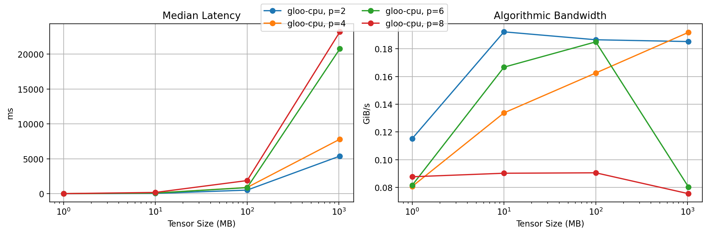

# Distributed Benchmark

- targets: gloo-cpu
- world_sizes: 2, 4, 6, 8
- tensor_sizes_mb: 1, 10, 100, 1024

| target   | world_size | tensor_size | median_ms | mean_ms   | algo_GiBps |
| -------- | ---------- | ----------- | --------- | --------- | ---------- |
| gloo-cpu | 2          | 1MB         | 8.476     | 8.517     | 0.115      |
| gloo-cpu | 2          | 10MB        | 50.797    | 51.094    | 0.192      |
| gloo-cpu | 2          | 100MB       | 523.528   | 526.105   | 0.187      |
| gloo-cpu | 2          | 1GB         | 5398.399  | 5398.969  | 0.185      |
| gloo-cpu | 4          | 1MB         | 18.153    | 18.488    | 0.081      |
| gloo-cpu | 4          | 10MB        | 109.498   | 110.754   | 0.134      |
| gloo-cpu | 4          | 100MB       | 901.176   | 911.375   | 0.163      |
| gloo-cpu | 4          | 1GB         | 7817.207  | 7812.762  | 0.192      |
| gloo-cpu | 6          | 1MB         | 19.964    | 20.654    | 0.082      |
| gloo-cpu | 6          | 10MB        | 97.604    | 97.988    | 0.167      |
| gloo-cpu | 6          | 100MB       | 879.720   | 877.797   | 0.185      |
| gloo-cpu | 6          | 1GB         | 20764.952 | 20206.942 | 0.080      |
| gloo-cpu | 8          | 1MB         | 19.493    | 23.385    | 0.088      |
| gloo-cpu | 8          | 10MB        | 189.436   | 190.334   | 0.090      |
| gloo-cpu | 8          | 100MB       | 1887.865  | 1912.338  | 0.091      |
| gloo-cpu | 8          | 1GB         | 23195.781 | 22370.482 | 0.075      |

