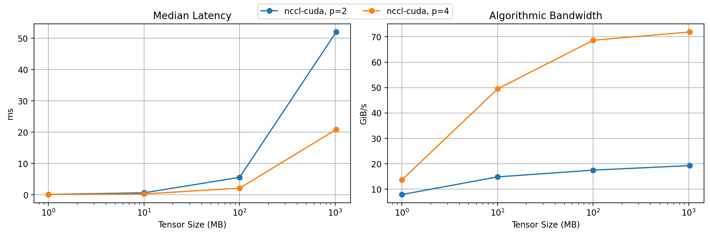

# Distributed Benchmark

- targets: nccl-cuda
- world_sizes: 2, 4
- tensor_sizes_mb: 1, 10, 100, 1024

| target    | world_size | tensor_size | median_ms | mean_ms | algo_GiBps |
| --------- | ---------- | ----------- | --------- | ------- | ---------- |
| nccl-cuda | 2          | 1MB         | 0.125     | 0.125   | 7.838      |
| nccl-cuda | 2          | 10MB        | 0.660     | 0.687   | 14.789     |
| nccl-cuda | 2          | 100MB       | 5.596     | 5.593   | 17.452     |
| nccl-cuda | 2          | 1GB         | 51.969    | 52.684  | 19.242     |
| nccl-cuda | 4          | 1MB         | 0.108     | 0.109   | 13.614     |
| nccl-cuda | 4          | 10MB        | 0.296     | 0.302   | 49.437     |
| nccl-cuda | 4          | 100MB       | 2.134     | 2.137   | 68.647     |
| nccl-cuda | 4          | 1GB         | 20.860    | 20.900  | 71.908     |

